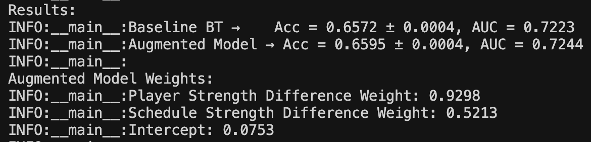
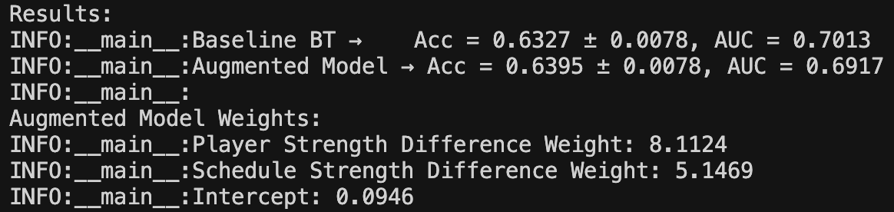
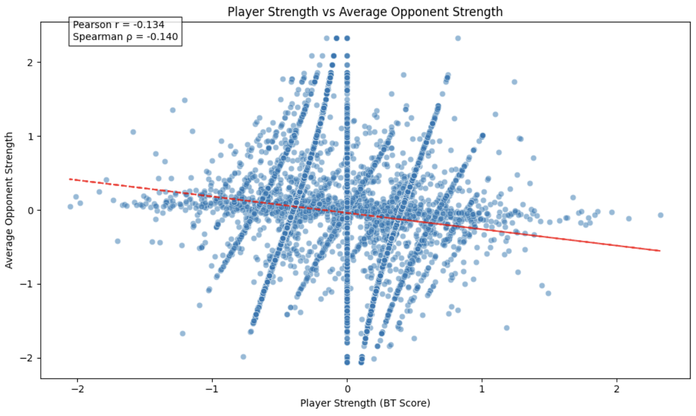

I was able to run a few ML experiments with direct real-world data from a small Lichess database with 20K games (https://www.kaggle.com/datasets/datasnaek/chess) and a larger Lichess database with 6M games (https://www.kaggle.com/datasets/arevel/chess-games/data). 

I wanted to build a prediction algorithm that could look only at a blind matrix of match results—i.e., without including any other data (e.g., Lichess Elos, move patterns, etc.). I tried to learn some rank-2+ embeddings implicitly as well as some more elaborate graph-based learning algorithms. In short, I tried a whole bunch of fancy little attempts at extensions but did not find positive results relative to the rank-1 version. 

However, I did manage to come up with a nice little two-feature model that does indeed outperform a classic rank-1 Elo-style method! This method leverages the fact that there's signal originating implicitly from the Lichess "matching" algorithm—which loosely tries to construct competitive similar-skill matchups and in turn subtly reveals player strength. The augmented model (with "schedule strength") achieves a performance bump on the 6M-match database. (There's definitely a ton more that can be done here—this is just a start.)

Nothing hugely groundbreaking, of course, but it's a humorous result :)

### 6M Dataset

### 20K Dataset

There's also a funny little Simpson's paradox when it comes to comparing learned player strength with learned player schedule strength. (Stronger "schedules" do provide a signal of strength as seen in the ML coefficients above.)

